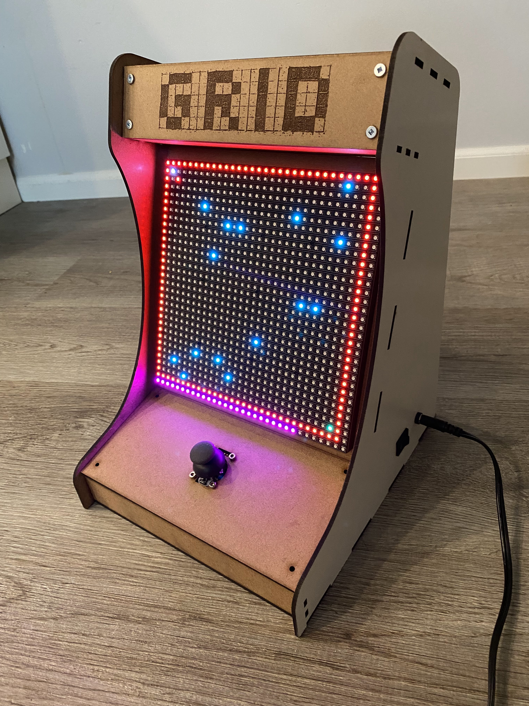
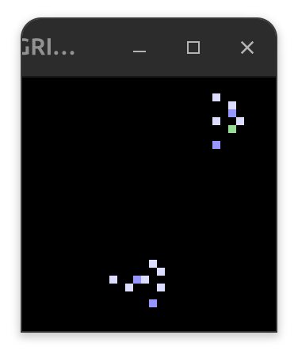

# GRID-Arcade

This is the **GRID** (**G**aming **R**etro **I**nteractive **D**evice), my fun hobby project to create a custom arcade box.

## What can it do?

First it welcomes the player:


Then you can select a program from the menu:


You can play a Maze escape game:


You can fly around as a [Boid](https://en.wikipedia.org/wiki/Boids) (digital bird):


You can adjust the input calibratin, if something feels off:


## Hardware
The display is a [32x32 RGB LED matrix](https://www.adafruit.com/product/1484) connected with an [Adafruit Metro M0 (SAMD21)](https://www.adafruit.com/product/3505) equipped with a [Adafruit RGB Matrix Shield](https://www.adafruit.com/product/2601). The unit is controlled by a PS2 Joystick hooked up to the Metro.

Everything is housed in a custom unit built in collaboration with my friend [Herman Tabunganua](https://www.linkedin.com/in/herman-tubungbanua/).

The Arduino IDE was used to compile and program the GRID software to the Adafruit MCU.



## Software
The GRID arcade can also be run as a desktop emulation. The software for each target is identical, to enable hardware-independent development and debugging. 

The software emulation uses the SDL library on a fixed-step timing loop to simulate the GRID logic and display. All the programs in GRID on hardware are available on the emulation. The main difference is that SDL displays the pixels as blocks. See screenshots below for how the emulation looks:




In addition, an "LED-mode" switch (by pressing the L key) can be activated for a more faithful look. 


## Running the GRID emulation

The emulation uses a simple Makefile with debug-friendly targets.

### Prereqs
- SDL2 development headers and libs
  - Linux: `sudo apt install libsdl2-dev` (or use `sdl2-config` / `pkg-config`)
- g++ with C++17

### Targets

- `make`  
  Release-ish build (O2).

- `make DEBUG=1` or `make debug`  
  Debug build with symbols, AddressSanitizer, and `-DDEBUG`.  
  Flags include: `-g -O0 -fno-omit-frame-pointer -fsanitize=address`.

- `make run`  
  Build then run `./build/grid`.

- `make run-debug`  
  Build with `DEBUG=1` then run.

- `make clean`  
  Remove the `build/` folder.

### Notes
- SDL flags are discovered via `pkg-config sdl2` or fall back to `sdl2-config`.
- On debug builds, ASan is enabled for both compile and link. If you need to disable leak reports temporarily:
```shell
ASAN_OPTIONS=detect_leaks=0 ./build/grid
```
